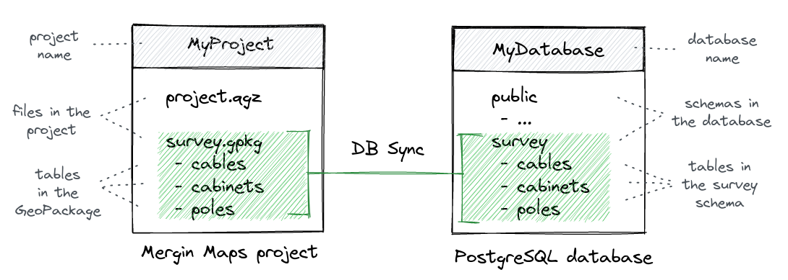

# Mergin Maps Database Sync

This tool takes care of two-way synchronization between [Mergin Maps](https://merginmaps.com/) and another database (currently supporting PostGIS).

That means you can:

- insert / update / delete features in PostGIS database - and the changes will get automatically
  pushed to a configured Mergin Maps project
- insert / update / delete features in a GeoPackage in Mergin Maps project - and the changes will get
  automatically pushed to the PostGIS database

## How does it work

A single GeoPackage file in a Mergin Maps project is treated as an equivalent of a database schema - both
GeoPackage and a database schema can contain  multiple tables with data - and the DB Sync tool keeps
content of the tables in the database and in the GeoPackage the same.

There are two ways how the synchronization can be started:
 1. Init from GeoPackage: if you have a Mergin Maps project with an existing GeoPackage, the tool will
    create the destination schema and tables in the database (and populate those with data from GeoPackage).
 2. Init from database: if you have database already populated with tables and data, the tool will
    create the destination GeoPackage in your Mergin Maps project and initialize it.

More technical details:
- to keep track of the changes in the database, the DB sync tool adds an extra schema in your database
  (called "base" schema). This schema contains another copy of the data and it should not be touched,
  otherwise the sync may get to invalid state.
- the "base" schema contains the same data as the most recently seen project version in Mergin Maps. Whenever
  the tool attempts to synchronize data, it looks up any pending changes in the database by comparing data
  between the "base" schema and the "modified" schema (used by editing) - if any changes are detacted,
  they will be pushed to the appropriate GeoPackage in Mergin Maps project.

<a href="https://merginmaps.com/community/join">Join our community chat</a> and ask questions!
 

## Getting started

Not sure where to start? Check out our [quick start](docs/quick_start.md) guide to set up sync between your database and a new Mergin Maps project.

## How to use

DB Sync should be run using the `dbsync_daemon.py` script.

1. set up configuration in config.yaml  (see config.yaml.default for a sample)

2. run `dbsync_daemon.py`. There are several parameters to control the way the tool runs (see [Using DB Sync](docs/using.md))

## Documentation

- [How to install](docs/install.md)
- [Using DB Sync](docs/using.md)
- [For developers](docs/development.md)

