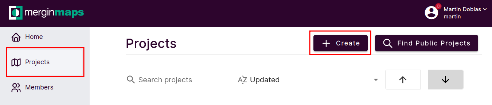
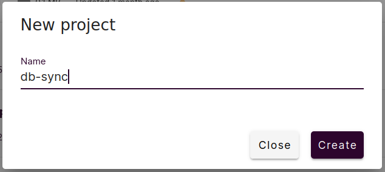

# Quick start guide

In this quick start guide you will set up synchronization between your PostGIS database and new Mergin Maps project.

## Prerequisites

- PostGIS database - details for DB [setup](./postgresql.md)
- Docker engine

If you are on Windows and do not have Docker installed, you can consider [installing it in Windows Subsystem for Linux](./install_wsl.md).

## 1. Add data to DB

Create a new schema (`sync_data`) in your postgis database (here `dbsync`) with few points.
You can simply use this [file](../sample_data/test_data.sql) and run:

```bash
$ psql -h localhost -d dbsync -U postgres -f sample_data/test_data.sql
```

## 2. Create an empty Mergin Maps project

Go to [Mergin Maps](https://app.merginmaps.com/) website and create a new blank project.





You should see there are not any files there.


and your full project name for later will be `<workspace>/<project-name>`, e.g. `john/db-sync`

## 3. Start syncing

Prepare `config.yaml` configuration file, and replace `<username>`, `<password>` and `<workspace>` with the real values (and also update database connection's username/password):

```yaml
mergin:
  url: https://app.merginmaps.com
  username: <username>
  password: <password>
init_from: db
connections:
   - driver: postgres
     conn_info: "host=localhost dbname=dbsync user=postgres password=mysecretpassword"
     modified: sync_data
     base: sync_data_base
     mergin_project: <workspace>/db-sync
     sync_file: sync_db.gpkg
daemon:
  sleep_time: 10
```

Run this Docker command (see [installation guide](install.md) for alternative options how to run db-sync):

```bash
docker run --network host -it -v ${PWD}:/settings lutraconsulting/mergin-db-sync /settings/config.yaml
```

and you should see a new GeoPackage file in your Mergin Maps project.


## 4. Set up QGIS project

To be able to use the synchronized GeoPackage as a survey layer:

- [Download the generated gpkg file with Mergin Maps plugin for QGIS](https://merginmaps.com/docs/tutorials/opening-surveyed-data-on-your-computer/#locating-and-opening-your-project) to an empty folder.
- Open it in QGIS
- Style it (if you wish)
- Save the QGIS project on the same folder as the downloaded gpkg file
- Upload the QGIS project to your Mergin Maps project, using the [Synchronise Mergin Maps project button](https://merginmaps.com/docs/manage/plugin-sync-project/#synchronisation-in-qgis)

The QGIS and GeoPackage files will be a valid Mergin Maps project ready for surveying. Read more about QGIS project configuration on [Mergin Maps](https://merginmaps.com/docs/) and [Mergin Maps Input](https://merginmaps.com/docs/) documentations.


In order to stop syncing simply stop docker container.
