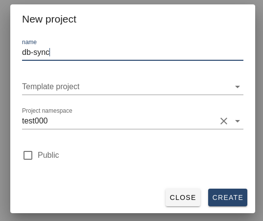
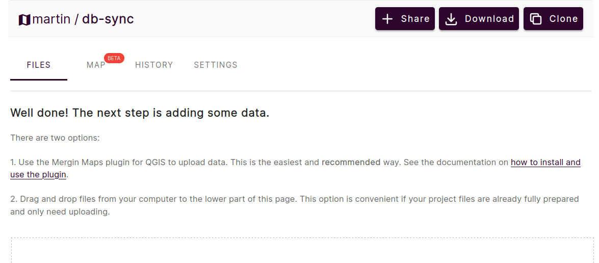
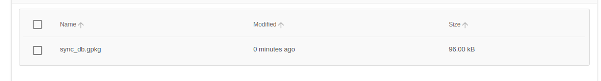

# Quick start guide

In this quick start guide you will set up synchronization between your PostGIS database and new Mergin Maps project.

## Prerequisites

- PostGIS database
- docker engine

If you are on Windows and do not have Docker installed, you can consider [installing it in Windows Subsystem for Linux](./install_wsl.md).

## 1. Add data to DB
Create a new schema (`sync_data`) in your postgis database (here `db-sync`) with few points.
You can simply use this [file](../sample_data/test_data.sql) and run:

```
$ psql -h localhost -d db-sync -U postgres -f sample_data/test_data.sql
```
## 2. Create an empty Mergin Maps project
Go to [Mergin Maps](https://app.merginmaps.com/) website and create a new blank project.



You should see there are not any files there.



and your full project name for later will be `<username>/<project-name>`, e.g. `john/db-sync`

## 3. Start syncing
Download and run db-sync docker image:

```
$ sudo docker run --name mergin_db_sync -it \
  -e MERGIN__USERNAME=john \
  -e MERGIN__PASSWORD=myStrongPassword \
  -e CONNECTIONS="[{driver='postgres', conn_info='host=myhost.com dbname=db-sync user=postgres password=top_secret', modified='sync_data', base='sync_base', mergin_project='john/db-sync', sync_file='sync_db.gpkg'}]" \
  lutraconsulting/mergin-db-sync:latest python3 dbsync_daemon.py --init-from-db
```
and you should see a new geopackage file in your Mergin Maps project. To be able to use the Geopackage as a survey layer:

- [Download the generated gpkg file with Mergin Maps plugin for QGIS](https://merginmaps.com/docs/tutorials/opening-surveyed-data-on-your-computer/#locating-and-opening-your-project) to an empty folder.
- Open it in QGIS
- Style it (if you wish)
- Save the QGIS project on the same folder as the downloaded gpkg file
- Upload the QGIS project to your Mergin Maps project, using the [Synchronise Mergin Maps project button](https://merginmaps.com/docs/manage/plugin-sync-project/#synchronisation-in-qgis)

The QGIS and Geopackage files will be a valid Mergin Maps project ready for surveying. Read more about QGIS project configuration on [Mergin Maps](https://merginmaps.com/docs/) and [Mergin Maps Input](https://merginmaps.com/docs/) documentations.



In order to stop syncing simply stop docker container.

---
Note: If you run your db-sync docker on the same host as your database is, you need to set up correct [networking](https://docs.docker.com/network/).
For instance, on linux for testing purpose you can use default bridge, e.g IP address `172.17.0.1`

## 4. Excluding tables from sync

Sometimes in the database there are tables that should not be synchronised to Mergin projects. It is possible to ignore
these tables and not sync them. To do so add `skip_tables` setting to the corresponding `CONNECTIONS` entry in the config
file

```
working_dir: /tmp/dbsync
geodiff_exe: geodiff

mergin:
  url: https://app.merginmaps.com
  username: john
  password: mysecret

connections:
   - driver: postgres
     conn_info:
     modified: mergin_main
     base: mergin_base
     mergin_project: john/myproject
     sync_file: sync.gpkg
     skip_tables:
      - table1
      - table2
      - ...
      - tableN

daemon:
  sleep_time: 10
```

or as environment variable

```
CONNECTIONS="[{driver='postgres', conn_info='host=myhost.com dbname=db-sync user=postgres password=top_secret', modified='sync_data', base='sync_base', mergin_project='john/db-sync', sync_file='sync_db.gpkg', skip_tables=[table1,table2,...,tableN]}]"
```
